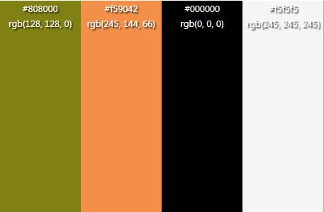

# **Bassicly**

Bassicly is a not-for-profit, community based website that aims to be a 'one-stop-shop for bass players all across the world. The site is targeted at people who have an interest in bass guitars, be that a complete starter or a seasoned professional. Bassicly will be useful for people who to immerse themselves in the bass-playing community, shop for their favourite gear and learn about bass players they may or may not have known about before.

I hope you enjoy Bassicly (insert deployed link)

# User Experience (UX)

## Site Structure

Bassicly has two seperate pages, the home page and the [home page](index.html), which is the defauly loading page and the [shop](shop.html) page. The [home page](index.html) has three main sections on it, the about section, which offers information on the different features of bassicly, the 'monthly' section which is highlights a new featured bass player every month, the 'upcoming gigs' section which shows a list of upcoming gigs, their location and the bass player of the listed band to keep it relevant to the page, followed by a sign up section which allows visitors to join our mailing list.

Both pages have a header with a logo and navigation bar as well as footer with links to social media.

## Design Choices

 * ### Typography
      The fonts chosen were 'Cairo' for the body and 'Montserrat' for the heading text. They fall back to sans-serif. 
     *  'Montserrat' was chosen for the headings as it is slightly more angular and works better in lesser groupings of letters.

      * 'Cairo' is used for the body text as it is more user friendly when in lager text groupings and compliments the heading text. 

 * ### Colour Scheme
      The colour scheme was chosen was that of what I would consider to be autumnal colours, dark olive greens and oranges feel to me to have a natural synergy with low sounds, such as the bass.

