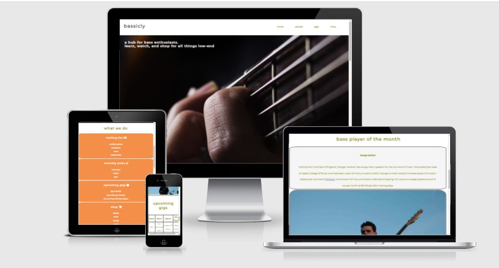
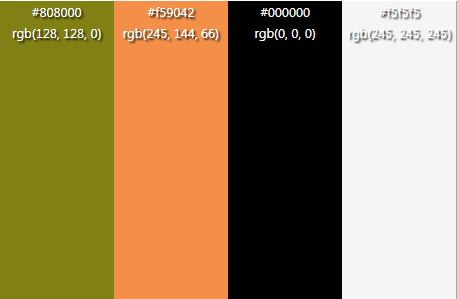
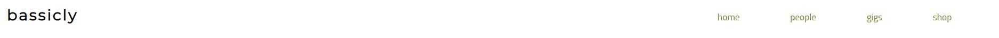
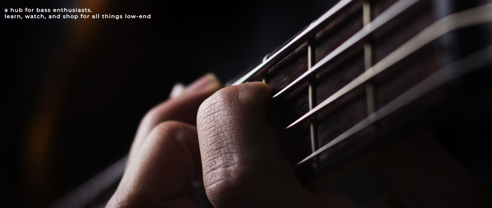
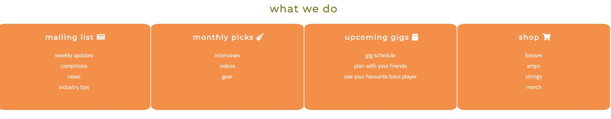
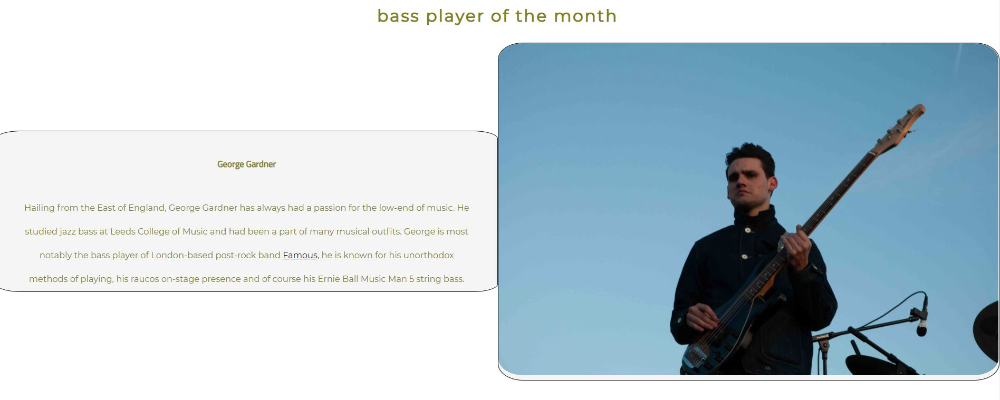
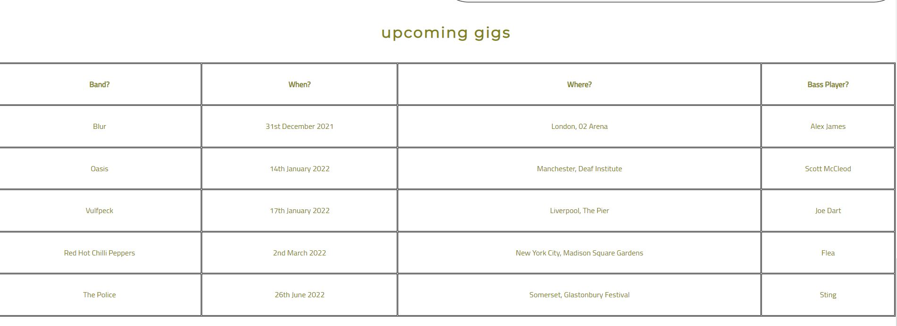

# **Bassicly**

Bassicly is a not-for-profit, community based website that aims to be a 'one-stop-shop for bass players all across the world. The site is targeted at people who have an interest in bass guitars, be that a complete starter or a seasoned professional. Bassicly will be useful for people who to immerse themselves in the bass-playing community, shop for their favourite gear and learn about bass players they may or may not have known about before.

I hope you enjoy Bassicly (insert deployed link)

# User Experience (UX)

## Site Structure

Bassicly has two seperate pages, the home page and the [home page](index.html), which is the defauly loading page and the [shop](shop.html) page. The [home page](index.html) has three main sections on it, the about section, which offers information on the different features of bassicly, the 'monthly' section which is highlights a new featured bass player every month, the 'upcoming gigs' section which shows a list of upcoming gigs, their location and the bass player of the listed band to keep it relevant to the page, followed by a sign up section which allows visitors to join our mailing list.

Both pages have a header with a logo and navigation bar as well as footer with links to social media.

## Design Choices

 * ### Typography
      The fonts chosen were 'Cairo' for the body and 'Montserrat' for the heading text. They fall back to sans-serif. 
     *  'Montserrat' was chosen for the headings as it is slightly more angular and works better in lesser groupings of letters.

      * 'Cairo' is used for the body text as it is more user friendly when in lager text groupings and compliments the heading text. 

 * ### Colour Scheme
      The colour scheme was chosen was that of what I would consider to be autumnal colours, dark olive greens and oranges feel to me to have a natural synergy with low sounds, such as the bass.

# Features

## Existing Features  
  * ### Navigation Menu

    * Going from left to right, this feature has a clickable logo which brings you back to the home page for good UX.
    * To the right of this is the nav-bar which has four links, one again for home for symantic clarity and, two that lead to an area of the same page: 'monthly' and 'gigs' and then one which links to the shop.
   

    

  * ### Hero Image

      * A large, clear, responsive image of a bass guitar with the website slogan on it to reinforce the purpose of the website to first-time users.
      
    

  * ### What We Do
    * The 'What We Do' section has 4 subsections cleary divided, each section relates to one of the functions of the website and lets the user know clearly what the function of the website is.  
    *  Each title of each section has an inbedded link to the section it related to for an increased level of user experience.

    

  * ### Monthly Section

    * The 'monthly' section is website-creator curated monthly show of a bass player, amateur or profoessional. The purpose is to expose users of the website to new material, specially chosen for clientelle of the website that will encourage them to come back on a monthly basis to find the next monthly pick.
    * It is styled as one information box and one image box.
    
    

  * ### Upcoming Gigs

    * The 'upcoming-gigs' section is a useful section which shows upcoming gigs of bands with <em>known</em> bass players. It clearly shows the name of the band, the location of the show, the location and importantly <strong>the name of the bass player.</strong>
    * They are styled in a table with psuedo-styling on the hover which highlights the row for greater clarity.

    
    

  * ### Signing up for the newsletter

    * The next section allows the user to sign up for the weekly newsletter, the description of which has already been made clear to the use in the 'what we do section'.
    * The submit buttom brings the user to the Code Insitute form dump.
    * In the future, I would like to create a bespoke confirmation page relating to bassicly.

* ### Footer
    
    * Contains social media links. To enhance the UX the links open in other tabs.
    * The social media presence will help the user with their research into Wawas Woods and will also encourage them to connect with Bassicly.
    
    
    
)

* ### Shop

    * At the moment, the shop is non-interactive. It currently consists of a list of what is for sale with an email address and phone number at the bottom of the page for which the user to use in the case of a purchase. 
    * In the future, I would like to have an interactive shop which allows the user to purchase the good from the website.
    * This section would be updated periodically to reflect new stock.

## Future Features 

* A videos section with a list of both the user-base and professional videos/
   
* A forum for bass players to discuss topics such as bands, gear, gigs and players.

# Bugs

* The main bugs come from the 'monthly', bugs that are still here. Whilst these bugs do not effect the functionality of the website, they do decrease the aesthetic value. The bugs are that when the width of the screen changes, the two sectrions, one for an image and one for info change size at different rates and proportions. As well as this the image does not quite reach the bottom of its container. 

# Technologies Used
* [HTML5](https://html.spec.whatwg.org/) - provides the content and structure for the website.
* [CSS](https://www.w3.org/Style/CSS/Overview.en.html) - provides the styling.
* [Gitpod](https://www.gitpod.io/#get-started) - used to deploy the website.
* [Github](https://github.com/) - used to host and edit the website.

# Testing

The Bassicly site code was tested with [W3C html Validator](https://validator.w3.org/) and the [W3C CSS Validator](https://jigsaw.w3.org/css-validator/). The two html pages both recieved the below message:

for the CSS:

## Responsiveness Test

* The responsive design tests were carried out manually with [Google Chrome DevTools](https://developer.chrome.com/docs/devtools/) and [Responsive Design Checker](https://www.responsivedesignchecker.com/).

|        | Moto G4 | Galaxy S5 | iPhone 5 | iPad | iPad Pro | Display <1200px | Display >1200px |
|--------|---------|-----------|----------|------|----------|-----------------|-----------------|
| Render | pass    | pass      | pass     | pass | pass     | pass            | pass            |
| Images | pass    | pass      | pass     | pass | pass     | pass            | pass            |
| Links  | pass    | pass      | pass     | pass | pass     | pass            | pass            |

Note: On wide display types the contents of the site are restricted in width to 2000px. This helps the UX by not spreading the content too wide on the extra wide screens.

## Browser Compatibility

Wawas Woods site was tested on the following browsers with no visible issues for the user. 
Google Chrome, Microsoft Edge, Safari and Mozilla Firefox. Appearance, functionality and responsiveness were consistent throughout for a range of device sizes and browsers.

## Lighthouse Testing:

# Deployment

### **To deploy the project**
The site was deployed to GitHub pages. The steps to deploy a site are as follows:
  1. In the GitHub repository, navigate to the **Settings** tab.
  2. Once in Settings, navigate to the **Pages** tab on the left hand side.
  3. Under **Source**, select the branch to **master**, then click **save**.
  4. Once the master branch has been selected, the page will be automatically refreshed with a detailed ribbon display to indicate the successful deployment.

   The live link to the Github repository can be found here - https://github.com/georgegardner97/Bassicly-

   ### **To fork the repository on GitHub**
A copy of the GitHub Repository can be made by forking the GitHub account. This copy can be viewed and changes can be made to the copy without affecting the original repository. Take the following steps to fork the repository;
1. Log in to **GitHub** and locate the [repository](https://github.com/georgegardner97/Bassicly-).
2. On the right hand side of the page inline with the repository name is a button called **'Fork'**, click on the button to create a copy of the original repository in your GitHub Account.

# Credits
### Content

* The font came from [Google Fonts](https://fonts.google.com/).
* The colour palate was compiled by [Colorcodes](https://htmlcolorcodes.com/).
* The icons came from [Font Awesome](https://fontawesome.com/).
* The form validation idea came from a [W3 Schools lesson](https://www.w3schools.com/css/css_form.asp).
* The inspiration for the code for the shop area come from a [YouTube](https://www.youtube.com/watch?v=Trw_9lisYVY)
* The stucture for the README folder came from [Wawas Woods](https://github.com/EwanColquhoun/wawaswoods)

### Media
* The photos all came from [Pexels](https://www.pexels.com/) accpeting the strings image which came from [Ernie Ball](https://ernieball.co.uk/) .
)

# Acknowledgements

Bassicly was completed for Project 1 of the Code Institute, I would like to thank my Mentor, Precious Ijege as well as the slack community. 

George Gardner 2021.

